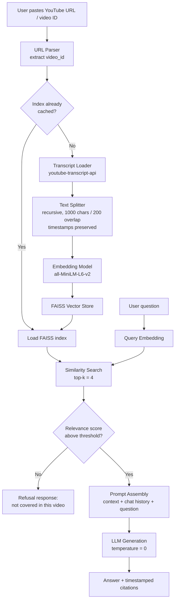

# YouTube RAG Chatbot

**Ask a question, get the answer from the video — without watching the video.**

A Retrieval-Augmented Generation (RAG) system that turns any YouTube video into a queryable knowledge source. Paste a URL or video ID, ask a question in natural language, and get a grounded answer with the exact timestamps it came from. If the video does not contain the answer, the system says so instead of guessing.

**Stack:** Python · LangChain · FAISS · Sentence-Transformers · LLM (OpenAI / Groq / local) · Streamlit

---

## 1. Problem Statement

Long-form video is one of the richest sources of technical and educational content on the internet, and one of the least searchable.

- A single lecture, podcast, or conference talk can run 40–180 minutes, while the information a viewer actually needs is often a 30-second span.
- YouTube's own search operates on titles, descriptions, and tags — not on what is actually said inside the video.
- Scrubbing through the timeline or skimming auto-generated captions is slow and unreliable.
- The worst case is the most common one: a user invests 20 minutes into a video and discovers it never covers the topic at all. That time is unrecoverable.

There is no low-friction way to ask a video a direct question and receive a direct, trustworthy answer.

## 2. Objective

Build a production-shaped conversational system that answers user questions from the spoken content of a YouTube video, in real time, with verifiable grounding.

**Functional objectives**

| # | Objective | Success criterion |
|---|-----------|-------------------|
| O1 | Accept a YouTube URL or bare video ID as the only required input | Handles `watch?v=`, `youtu.be/`, `shorts/`, `embed/`, and raw 11-character IDs |
| O2 | Ingest and index the transcript automatically | Transcript fetched, chunked, embedded, and indexed with no manual preprocessing |
| O3 | Answer natural-language questions in a real-time chat interface | Sub-3-second response on a cached index |
| O4 | Ground every answer in retrieved transcript evidence | Each answer returns supporting passages with timestamps |
| O5 | Support multi-turn conversation with memory | Follow-up questions such as "explain that in simpler terms" resolve correctly |

**Non-functional objective — the core design constraint**

> **O6 — Zero-hallucination policy.** If the retrieved context does not contain the answer, the chatbot must explicitly decline rather than fabricate one.

This is the most important requirement in the project. An assistant that confidently invents an answer is worse than no assistant at all, because the user has no way to detect the error without watching the video — which is exactly the cost the system exists to eliminate. Section 5 describes how this is enforced.

## 3. System Architecture



### Pipeline stages

**Stage 1 — Ingestion.** The URL parser normalises every supported YouTube link format down to an 11-character video ID. The transcript loader pulls the caption track, preferring manually authored captions over auto-generated ones and falling back across available languages.

**Stage 2 — Chunking.** The raw transcript is a flat stream of short caption segments, which is unusable for retrieval. A recursive character splitter reassembles it into ~1000-character chunks with 200-character overlap, so that a sentence spanning a chunk boundary is not lost. Each chunk carries its start timestamp as metadata, which is what makes citation possible.

**Stage 3 — Indexing.** Chunks are embedded and written to a FAISS index. The index is cached by video ID, so a second question on the same video skips ingestion entirely.

**Stage 4 — Retrieval.** The user question is embedded into the same vector space and the top-k most similar chunks are retrieved. A similarity threshold acts as the first hallucination gate.

**Stage 5 — Generation.** Retrieved chunks, condensed chat history, and the question are assembled into a constrained prompt and sent to the LLM at temperature 0. The answer is returned with its supporting timestamps.

## 4. Tech Stack

| Layer | Technology | Rationale |
|-------|-----------|-----------|
| Transcript ingestion | `youtube-transcript-api` | No API key, no quota, no video download |
| Orchestration | LangChain | Composable retriever → prompt → LLM chains with built-in memory |
| Chunking | `RecursiveCharacterTextSplitter` | Respects semantic boundaries better than fixed-width splits |
| Embeddings | `sentence-transformers/all-MiniLM-L6-v2` | 384-dim, runs on CPU, strong quality-to-cost ratio |
| Vector store | FAISS | Fast in-memory ANN search; local, zero infrastructure cost |
| LLM | Configurable (OpenAI GPT / Groq Llama / local) | Provider-agnostic interface, swappable via config |
| Interface | Streamlit | Real-time chat UI with session state in pure Python |
| Config | `python-dotenv` | Credentials kept out of source control |

## 5. Hallucination Control — Design Detail

The zero-hallucination guarantee is not a single prompt instruction. It is enforced at four independent layers, so that a failure at one layer is caught by the next.

**Layer 1 — Retrieval gate.** Before the LLM is invoked at all, retrieved chunks are checked against a cosine-similarity threshold. If no chunk clears it, the question is answered with a refusal and the LLM is never called. This blocks the entire class of failures where a model reasons plausibly over irrelevant context.

**Layer 2 — Prompt constraint.** The system prompt restricts the model to the supplied context and gives it an explicit, sanctioned escape hatch:

```
You are a question-answering assistant for a single YouTube video.
Answer ONLY from the transcript context provided below.

Rules:
- If the context does not contain the answer, reply exactly:
  "This topic is not covered in this video."
- Never use outside knowledge, even if you are confident it is correct.
- Never infer, extrapolate, or fill gaps.
- Quote or paraphrase only what is present in the context.

Context:
{context}

Question: {question}
```

Giving the model a clearly correct refusal option matters more than forbidding fabrication. Models hallucinate hardest when refusal feels like failure.

**Layer 3 — Decoding constraint.** Generation runs at `temperature=0`. Sampling diversity is the mechanism by which ungrounded content enters an answer; removing it removes the mechanism.

**Layer 4 — Citation surface.** Every answer ships with the transcript excerpts and timestamps it was built from. The user can verify any claim in one click. This converts trust from something the system asserts into something the user can check.

## 6. Installation & Usage

```bash
# Clone
git clone https://github.com/KzRaihan/youtube-rag-chatbot.git
cd youtube-rag-chatbot

# Environment
python -m venv venv
source venv/bin/activate        # Windows: venv\Scripts\activate
pip install -r requirements.txt

# Configure
cp .env.example .env
# add your LLM API key to .env

# Run
streamlit run app.py
```

Open `http://localhost:8501`, paste a YouTube URL, wait for the index to build, and start asking questions.

### Project structure

```
youtube-rag-chatbot/
├── app.py                  # Streamlit interface and session state
├── src/
│   ├── loader.py           # URL parsing and transcript retrieval
│   ├── chunker.py          # Splitting with timestamp metadata
│   ├── vectorstore.py      # Embedding and FAISS index management
│   ├── chain.py            # Retrieval chain, prompt, memory
│   └── config.py           # Model and threshold configuration
├── cache/                  # Persisted FAISS indexes, keyed by video ID
├── requirements.txt
└── .env.example
```

## 7. Example Interactions

**In-scope question**

> **User:** What optimizer does the speaker recommend for transformer training?
>
> **Bot:** The speaker recommends AdamW with a linear warmup over the first 10,000 steps, noting that plain Adam caused instability in their early experiments.
>
> *Sources — [12:04], [13:41]*

**Follow-up (multi-turn memory)**

> **User:** Why was it unstable?
>
> **Bot:** The instability came from the lack of decoupled weight decay in plain Adam, which the speaker says interacted badly with the learning-rate schedule and produced loss spikes around step 4,000.
>
> *Sources — [13:41], [14:20]*

**Out-of-scope question — the refusal path**

> **User:** How do I deploy this model to AWS SageMaker?
>
> **Bot:** This topic is not covered in this video.

The third example is the one worth reading closely. The model has extensive knowledge about SageMaker deployment and would answer fluently if allowed to. Suppressing that answer is the feature.

## 8. Evaluation

The system was evaluated on a held-out question set built from a sample of videos across technical, educational, and interview formats.

| Metric | What it measures | How it was tested |
|--------|------------------|-------------------|
| Answer relevance | Does the answer address the question? | Manual rating on in-scope questions |
| Faithfulness | Is every claim supported by retrieved context? | Claim-by-claim check against cited chunks |
| Refusal accuracy | Are out-of-scope questions correctly declined? | Adversarial set of plausible-but-absent topics |
| Retrieval hit rate | Is the correct chunk in the top-k? | Manually annotated ground-truth spans |
| Latency | Cold-start ingestion vs. cached query | Wall-clock timing |

The adversarial refusal set is the most informative of these. It is deliberately built from questions that are *adjacent* to the video's topic — the cases where a model is most tempted to answer from parametric memory rather than from context.

<!-- TODO: replace the paragraph above with your measured numbers before sharing this repo. -->

## 9. Engineering Decisions

**Why transcripts rather than audio transcription?** Running Whisper over every video would add GPU cost and minutes of latency to gain quality only on videos that lack captions. Caption-track ingestion is instant and covers the large majority of long-form content. Whisper is the documented fallback, not the default.

**Why FAISS rather than a hosted vector database?** Each video is an independent, disposable index of a few hundred chunks. There is no cross-video search requirement and no persistence requirement beyond caching, so a managed service would add cost, latency, and a network dependency for no functional gain.

**Why chunk overlap?** Spoken language does not respect character boundaries. Without overlap, a definition that begins at the end of one chunk and completes at the start of the next is retrievable in neither. 200 characters of overlap makes boundary-spanning content redundantly available.

**Why cache by video ID?** Ingestion is the expensive stage and the question is rarely singular — users ask three to five questions per video. Caching moves that cost from per-question to per-video.

## 10. Limitations

- **Caption dependency.** Videos with captions disabled cannot be processed without the Whisper fallback enabled.
- **Speech only.** Information conveyed visually — slides, on-screen code, diagrams, written formulas — is invisible to the system. This is the largest gap.
- **Auto-caption quality.** Automatic captions mis-transcribe technical vocabulary and proper nouns, which degrades both retrieval and answer quality.
- **Single-video scope.** Each session is scoped to one video; cross-video and playlist-level questions are not supported.
- **Semantic retrieval limits.** Questions requiring synthesis across the whole video ("summarise the speaker's overall argument") are served poorly by top-k chunk retrieval, which is local by construction.

## 11. Roadmap

- [ ] Whisper fallback for videos without caption tracks
- [ ] Multimodal ingestion — sample keyframes and OCR on-screen text to close the visual gap
- [ ] Playlist and channel-level indexing for cross-video questions
- [ ] Hybrid retrieval (BM25 + dense) to improve recall on exact technical terms
- [ ] Cross-encoder reranking of the candidate set before generation
- [ ] Clickable timestamps that seek an embedded player directly to the cited moment
- [ ] Automated RAGAS evaluation wired into CI
- [ ] Docker packaging and cloud deployment

---

## Author

**Md. Kamruzzaman Raihan**  
B.Sc. in Computer Science & Engineering — Sonargaon University

[GitHub](https://github.com/KzRaihan) · [LinkedIn](https://linkedin.com/in/kzraihan/)

---

*Licensed under the MIT License.*